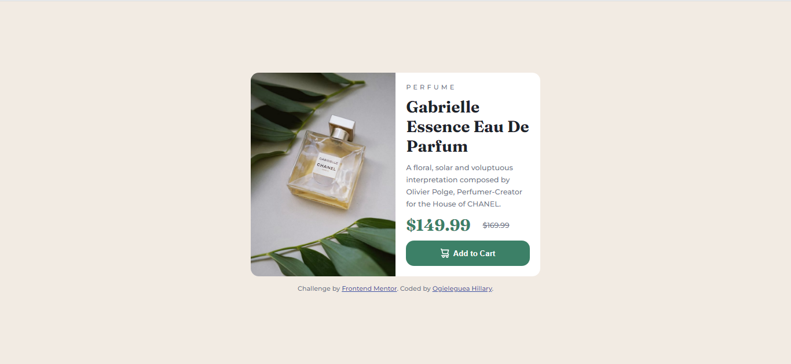

# Frontend Mentor - Product preview card component solution

This is a solution to the [Product preview card component challenge on Frontend Mentor](https://www.frontendmentor.io/challenges/product-preview-card-component-GO7UmttRfa). Frontend Mentor challenges help you improve your coding skills by building realistic projects.

## Table of contents

- [Overview](#overview)
  - [The challenge](#the-challenge)
  - [Screenshot](#screenshot)
  - [Links](#links)
- [My process](#my-process)
  - [Built with](#built-with)
  - [What I learned](#what-i-learned)
  - [Continued development](#continued-development)
  - [Useful resources](#useful-resources)
- [Author](#author)

## Overview

### The challenge

Users should be able to:

- View the optimal layout depending on their device's screen size
- See hover and focus states for interactive elements

### Screenshot




### Links

- Solution URL: [product-review-card-component](https://github.com/HillaryWebb-coder/product-review-card-component)
- Live Site URL: [product-component.netlify.app](https://product-component.netlify.app/)

## My process

### Built with

- Semantic HTML5 markup
- CSS custom properties
- Flexbox
- CSS Grid
- Mobile-first workflow

### What I learned

I was able to properly apply css grid to responsively align items in a div relative to each other

To see how you can add code snippets, see below:

desktop-version

```css
.card {
  max-width: 500px;
  grid-template-columns: repeat(2, 1fr);
  grid-template-rows: auto;
}
```

mobile-version

```css
.card {
  display: grid;
  grid-template-rows: repeat(2, 1fr);
}
```

### Continued development

- Responsive design
- css grid

### Useful resources

- [Responsive grid in 2 minutes with CSS Grid Layout](https://travishorn.com/responsive-grid-in-2-minutes-with-css-grid-layout-4842a41420fe) - This helped me understand and apply css grid

## Author

- Website - [Ogieleguea Hillary](https://www.github.com/hillarywebb-coder)
- Frontend Mentor - [@HillaryWebb-coder](https://www.frontendmentor.io/profile/HillaryWebb-coder)
- Twitter - [@OgielegueaH](https://twitter.com/OgielegueaH)
